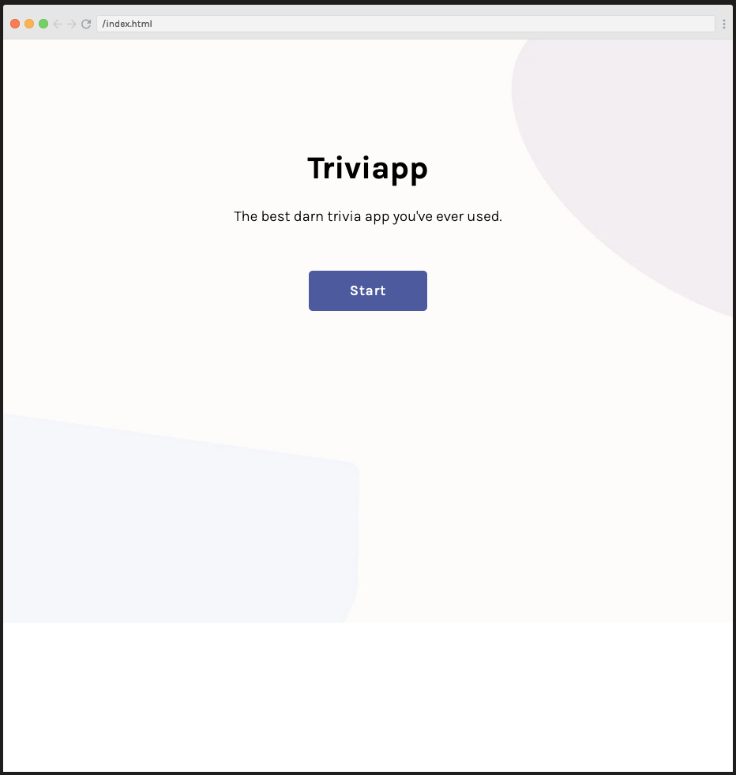
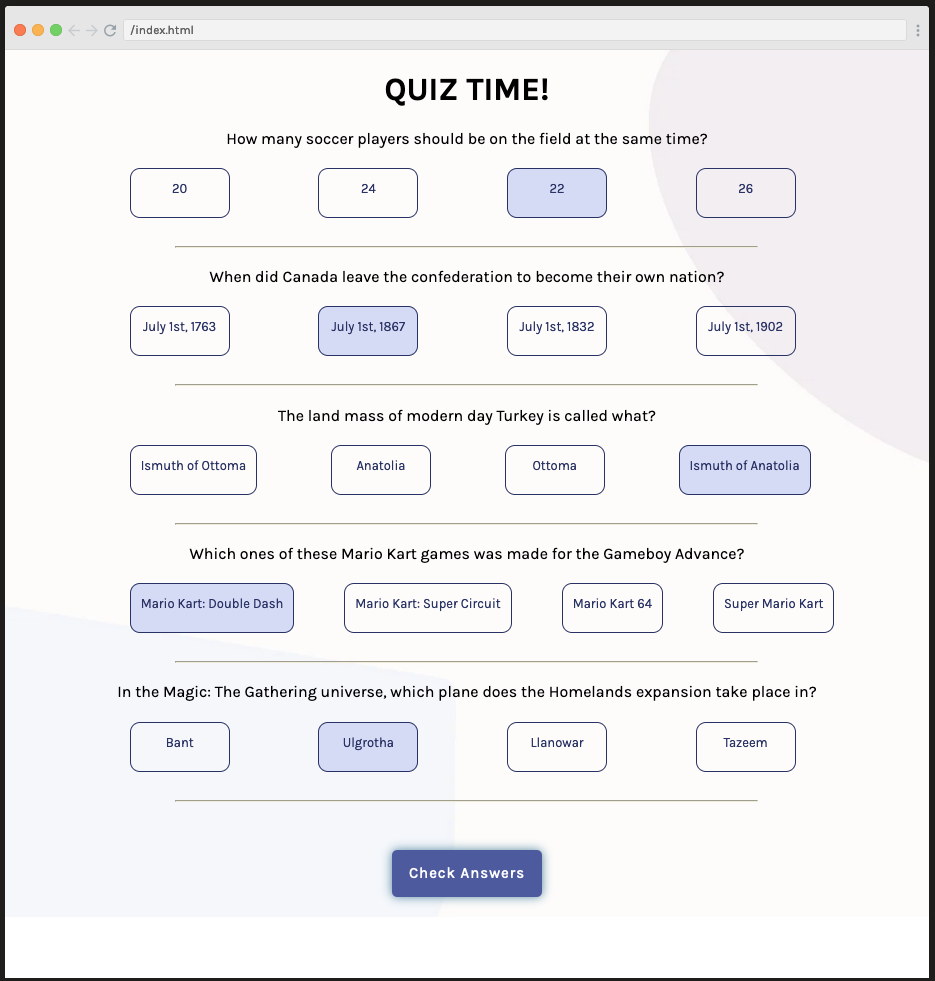
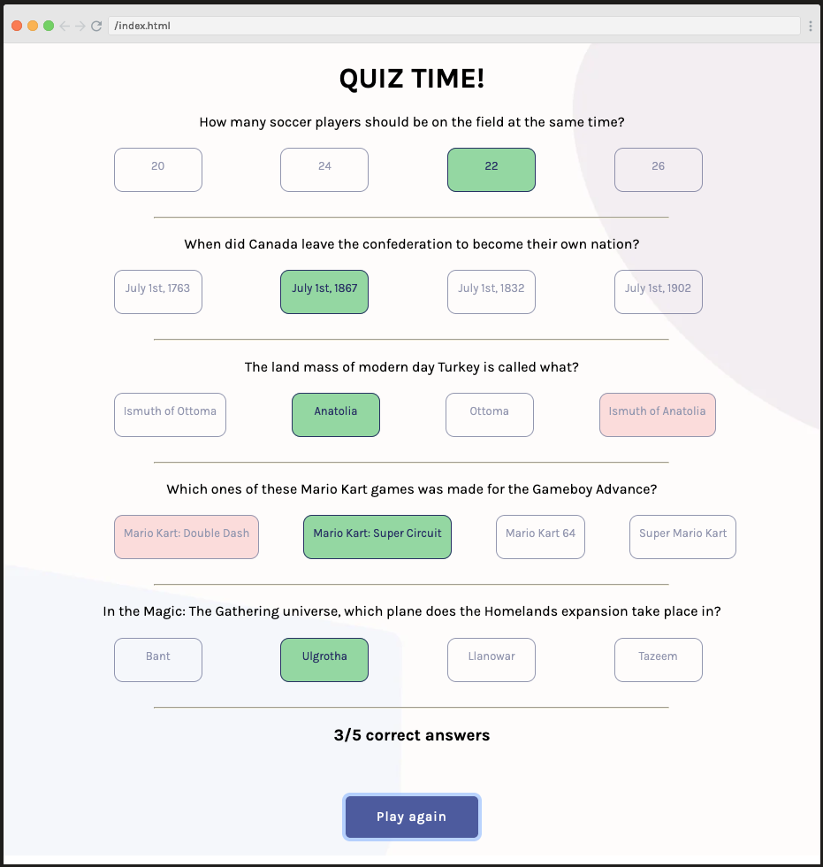

# Scrimba 'Learn React' Section 4 Solo Project:
## _"Build a Quiz Application"_

This project is a quiz application that was built using React to practice some React concepts that I learned in the
Scrimba React course.

The code was written within the Scrimba environment and is really easy to check it
in your own browser here: https://scrimba.com/scrim/co8c345368de53235a8e25972

Some bits I've identified that could be improved:
* Properly handle encoding of questions and options that are returned from the Trivia API
* Handle dynamic classes better for styling of multi-choice options
* Extend question/answer logic to handle true & false type questions from the Trivia API

## Supporting Scrimba

Since 2017, we have created over 20 free courses on Scrimba, and we're going to
continue launching free courses. But to pay our bills, we have to charge once
in a while. So if you've ever wanted to "give back" to Scrimba, you can do that by buying
one of our paid courses

- [Become a professional React developer](https://scrimba.com/course/greact)
- [The Responsive Web Design Bootcamp](https://scrimba.com/course/gresponsive)
- [The Ultimate JavaScript Bootcamp](https://scrimba.com/course/gjavascript)

  It would also mean the world to us if you share the courses.

Happy Coding!
